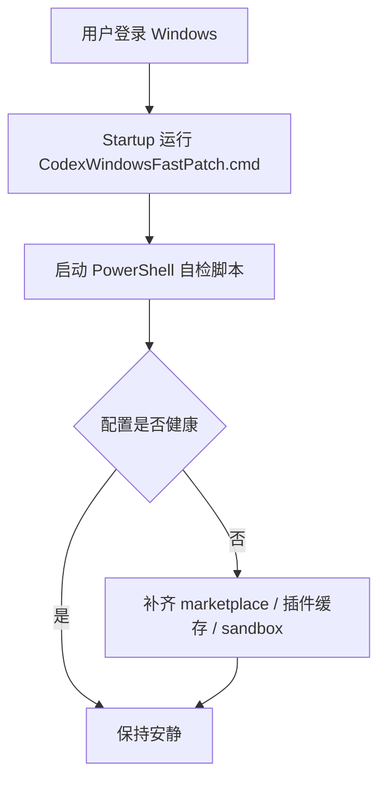

今天折腾的是 Codex Desktop 在 Windows 上的一个老大难问题：Fast Mode、插件市场、Chrome 插件、Computer Use 看起来都像是“装了”，但重启之后又不稳定。最烦的地方不是它直接报错，而是状态会来回变，像是刚修好，下一次打开又回到原点。

我参考了一篇排障文章，里面提到一个关键点：**不要直接依赖 WindowsApps 里的 Codex 安装目录**。这个目录受 Windows 应用包保护，很多时候从里面读插件、执行文件或者注册插件源，都会碰到奇怪的权限问题，比如 `os error 6000`。所以这次修复的核心思路，不是硬改系统目录，而是把官方 bundled 插件源搬到用户可写的位置，再让 Codex 从这个稳定位置加载。

## 一开始的问题

表面上看，是 Codex Desktop 里几个能力不好用：

- Fast Mode 不稳定，Windows sandbox 配置会被改回去；
- 插件市场里 `openai-bundled` 没有稳定注册；
- `chrome`、`browser`、`computer-use` 这些插件缓存不完整；
- 重启 Codex Desktop 后，刚修好的配置又可能被覆盖。

这几个问题其实是一条链子上的。插件源不稳定，插件市场就看不到；插件市场看不到，Computer Use 就加载不上；而配置文件又会被桌面端重写，所以只手动改一次 `config.toml` 没用。


## 真正有效的修法

最后采用的是一个比较稳的方案：**用户目录镜像 + 配置补齐 + 登录自检**。

先把 `openai-bundled` 插件源固定到一个普通用户目录：

```text
C:\Users\31756\Documents\Codex\codex-openai-bundled
```

然后在 Codex 的配置文件里恢复 marketplace 和插件启用项：

```text
C:\Users\31756\.codex\config.toml
```

关键段落大概长这样：

```toml
[marketplaces.openai-bundled]
source_type = "local"
source = '\\?\C:\Users\31756\Documents\Codex\codex-openai-bundled'

[plugins."chrome@openai-bundled"]
enabled = true

[plugins."computer-use@openai-bundled"]
enabled = true
```

同时确认插件缓存里这几个 manifest 都存在：

| 插件 | 作用 | 修复状态 |
|---|---|---|
| `chrome` | 调用用户已有 Chrome 状态 | 已补齐 |
| `browser` | Codex 内置浏览器控制 | 已补齐 |
| `computer-use` | Windows 桌面控制能力 | 已补齐 |
| `sites` | 网站构建相关能力 | 已补齐 |
| `latex` | 研究/排版辅助能力 | 已补齐 |

这里还有个小坑：之前配置里残留过一行 `notify = ...computer-use...`，看起来像是为了让 Computer Use 接收回调，但实际会污染当前配置。我这次把它清掉了，只保留 marketplace 和 plugin 本身需要的内容。

## 为什么要做自检脚本

如果只是手动改配置，短期看起来会好，但 Codex Desktop 后面可能还会重写 `config.toml`。所以这次我没有停在“一次性修复”，而是写了一个自愈脚本：

```text
C:\Users\31756\Documents\Codex\codex-openai-bundled-repair\repair-codex-windows-fast-patch.ps1
```

脚本做的事很简单：

1. 检查 `openai-bundled` 镜像是否还在；
2. 检查五个插件缓存是否完整；
3. 检查 `config.toml` 里 marketplace 和插件段落是否唯一；
4. 如果发现被覆盖，就自动补回去；
5. 额外确认 `windows.sandbox = "elevated"`，保证 Fast Mode 基础配置在。

本来我想用 Windows 计划任务在登录后启动它，但这台机器当前权限不允许注册任务，返回了 `Access is denied`。所以最后换成了更朴素的方案：在启动文件夹里放一个 `.cmd`。

```text
C:\Users\31756\AppData\Roaming\Microsoft\Windows\Start Menu\Programs\Startup\CodexWindowsFastPatch.cmd
```

这个文件会在用户登录后启动补丁脚本，每 30 秒检查一次。它不改模型配置、不碰 token、不动 MCP，只管理 `openai-bundled` 这一小块。



## 最后怎么验证

修完以后我没有只看“感觉能用了”，而是按几个可量化的点验了一遍：

- `notify` 行数量：`0`；
- `[marketplaces.openai-bundled]`：只有 `1` 份；
- `chrome / computer-use / browser / sites / latex`：每个插件启用段都只有 `1` 份；
- `windows.sandbox = "elevated"`：存在；
- 五个插件的 `plugin.json`：都能在缓存目录里找到；
- 启动文件夹里的 `CodexWindowsFastPatch.cmd`：存在。


我比较喜欢这次修复的地方是，它没有去硬碰 WindowsApps，也没有靠玄学重装。问题的根子是“插件源和配置持久化不稳”，那就把插件源搬到可控目录，再写一个幂等的小脚本盯住它。

以后如果 Codex Desktop 更新，可能还会带来新的插件版本，但这个思路应该还能继续用：**系统目录只当来源，不当长期依赖；用户目录做稳定镜像；配置修复要可重复执行。** 这比每次出问题都手动复制、手动改 TOML，要安心很多。
